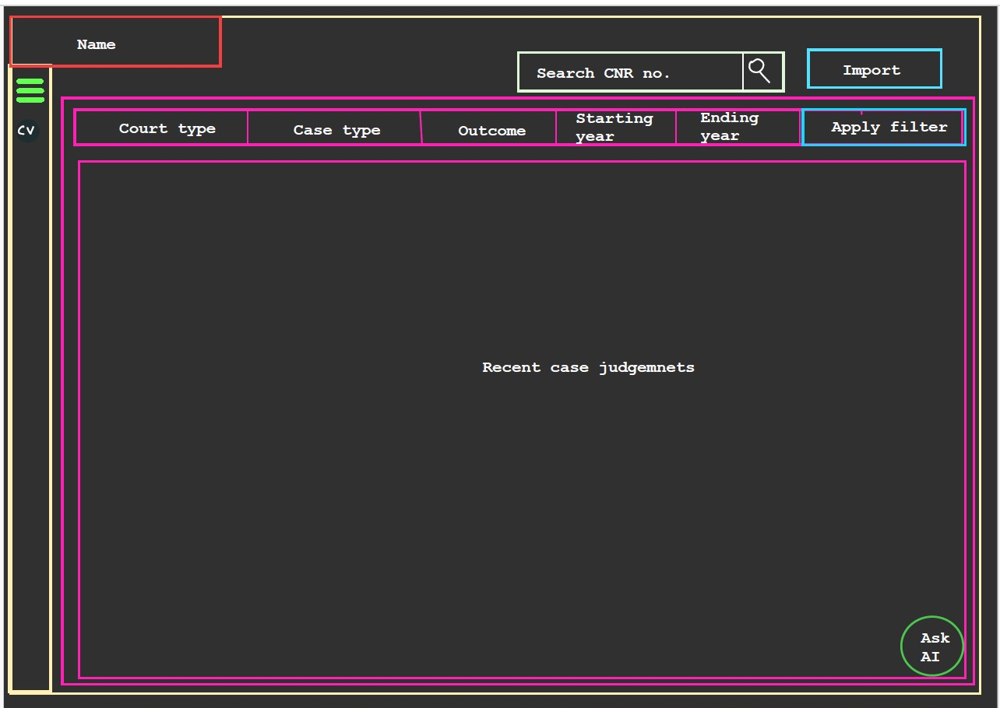
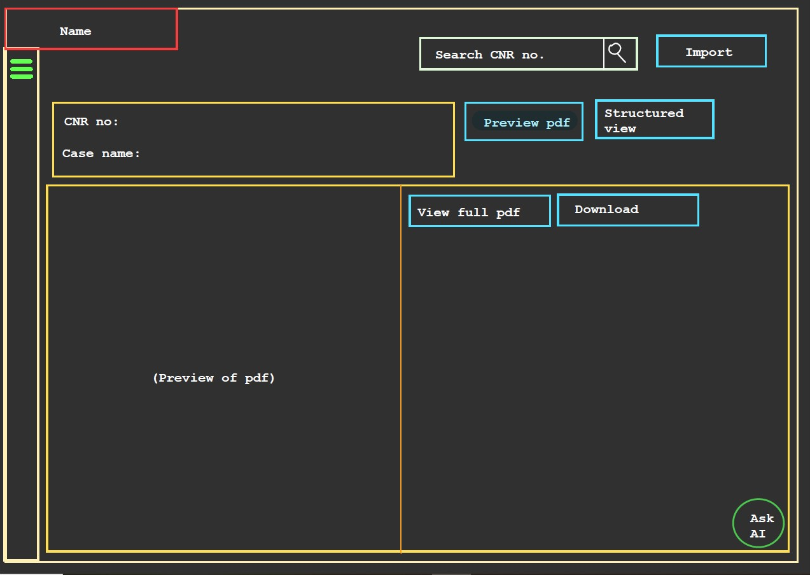
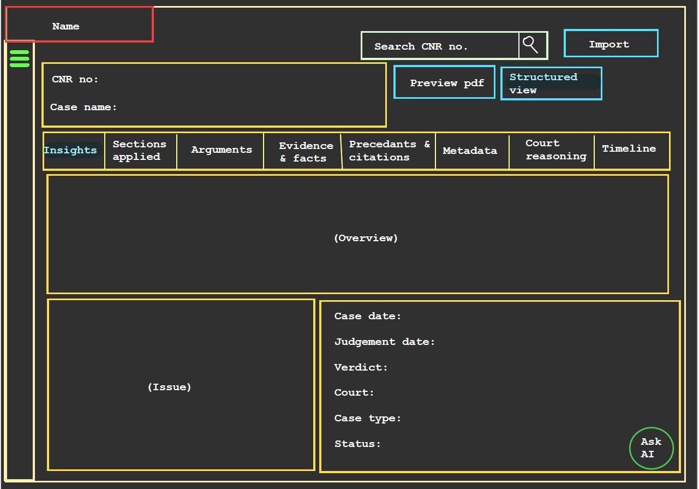
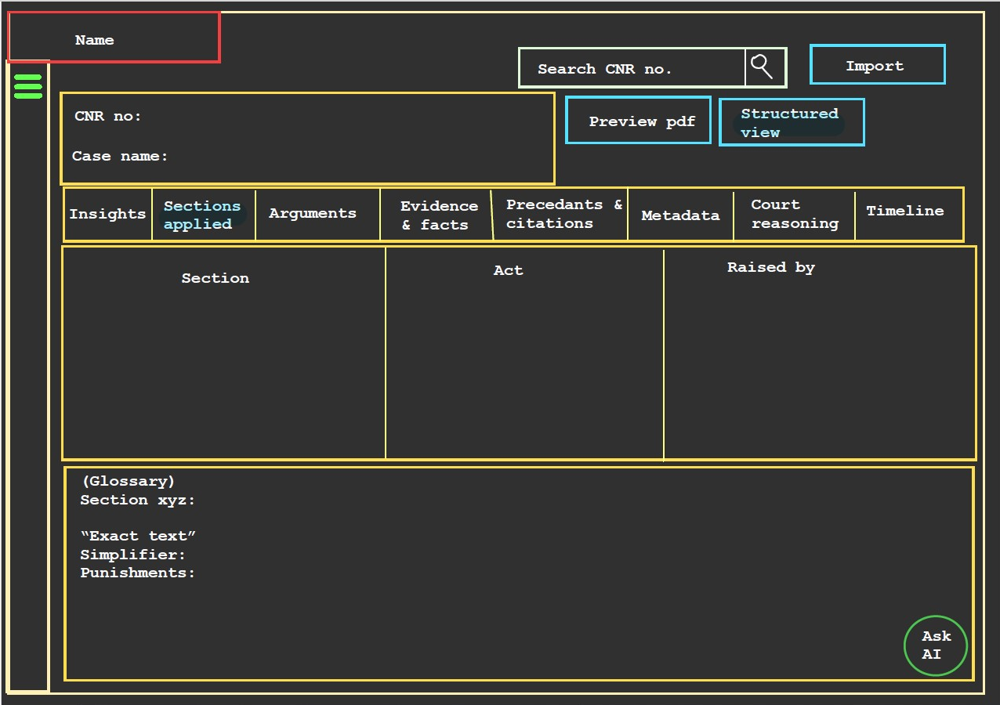
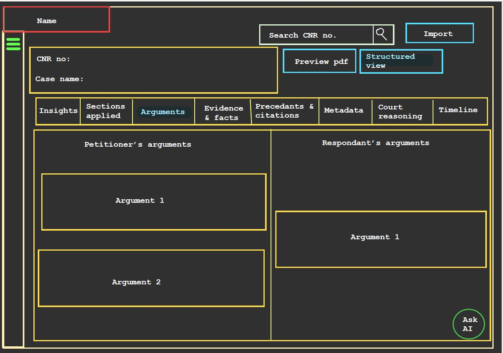
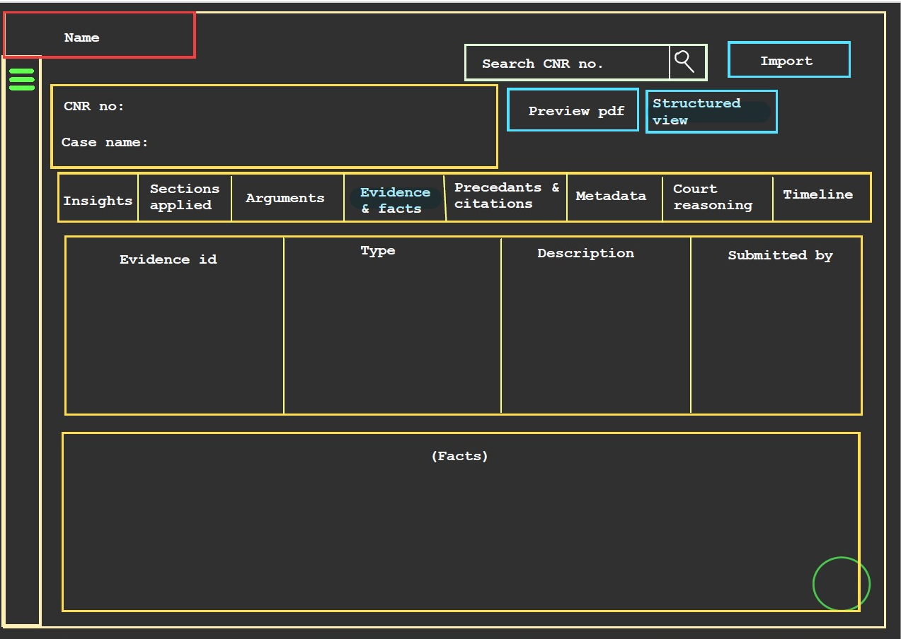
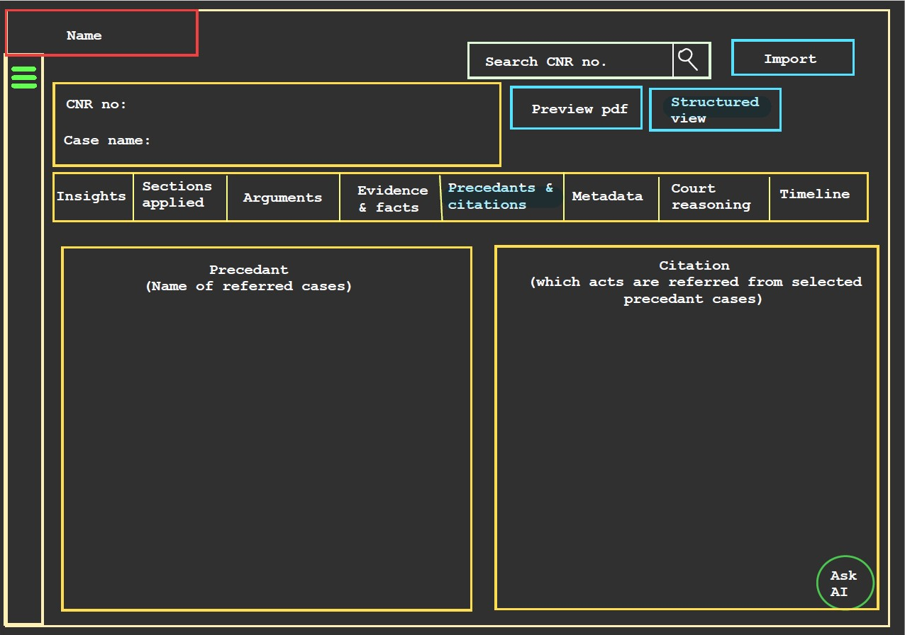
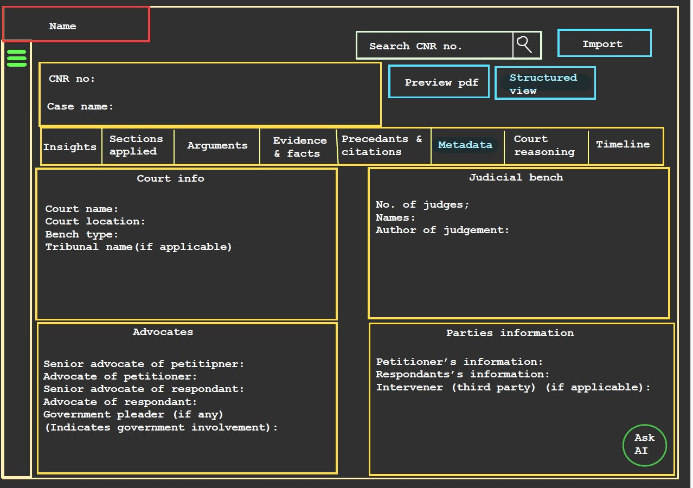
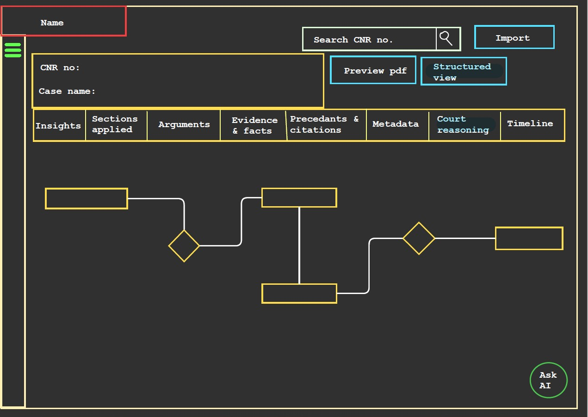
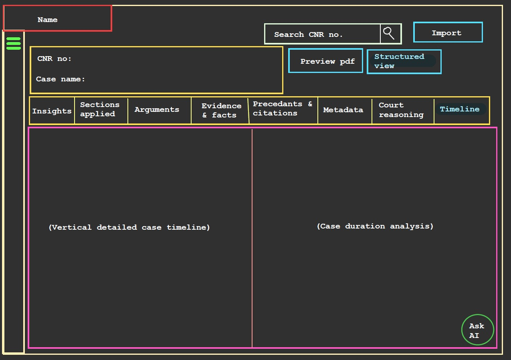

# Case View — Structured Documentation

## Overview

The Case View is the primary interface for exploring legal case judgments.

---

## Table of Contents

1. Default State — Recent Judgements  
2. Case Loaded State — PDF Preview  
3. Structured View — Tab System  
   - Insights  
   - Sections Applied (Agent-powered)  
   - Arguments  
   - Evidence & Facts  
   - Precedents & Citations  
   - Metadata  
   - Court Reasoning  
   - Timeline (Agent-powered)   
4. Agent Builder Integration  

---

## 1. Default State — Recent Judgements

**Trigger:**  
User navigates to Case View without entering a CNR number or uploading a file.

### Interface Elements

#### Filter Bar

| Filter | Type | Options |
|--------|------|--------|
| Court Type | Dropdown | Supreme Court, High Court, District Court |
| Case Type | Dropdown | Civil, Criminal, Constitutional |
| Outcome | Dropdown | Allowed, Dismissed, Remanded |
| Starting Year | Year Picker | Numeric Input |
| Ending Year | Year Picker | Numeric Input |

#### Recent Case Judgements Panel

- Displays a list of recent cases  
- Clicking a case loads it into the **Case Loaded State**

---

## 2. Case Loaded State — PDF Preview

**Trigger:**  
User enters a valid CNR number or uploads a PDF.

### Case Identity Bar

| Field | Description |
|------|------------|
| CNR No. | Case reference number |
| Case Name | Full case title |
| Preview PDF | Default active view |
| Structured View | Switches to tab-based analysis |

### Behavior

- PDF preview limited to 5 pages for performance  
- Full document available via **View Full PDF**  
- Inline error displayed if CNR lookup fails  
---

## 3. Structured View — Tab System

**Trigger:**  
User clicks **Structured View**

- Replaces PDF preview with tab interface  
- Tabs represent different analytical perspectives  
- Active tab highlighted  
- Horizontal scrolling supported on smaller screens  

---

## 3.1 Insights Tab

**Purpose:**  
Provides high-level summary and key facts.

## 3.2 Sections Applied

**Purpose:**  
Displays all laws and sections referenced in the case.

### Glossary Panel - 
- **Powered by:** Agent Builder
- **Exact Text** — Original legal wording  
- **Simplifier** — Plain-language explanation  
- **Punishments** — Applicable penalties

---

## 3.3 Arguments Tab

**Purpose:**  
Displays arguments from both sides.

---

## 3.4 Evidence & Facts Tab

**Purpose:**  
Provides structured evidence and factual summary.

### Evidence Types

Documentary · Oral · Expert · Forensic · Digital · Physical

### Facts Panel

- Narrative summary  
- Chronological where possible
   
---

## 3.5 Precedents & Citations Tab

**Purpose:**  
Displays referenced cases and related citations.

---

## 3.6 Metadata Tab

**Purpose:**  
Displays complete administrative case information.

---

## 3.7 Court Reasoning Tab

**Purpose:**  
Visualizes the court’s reasoning process.

---

## 3.8 Timeline

**Purpose:**  
Displays chronological case progression and duration analysis.

**Powered by:** Agent Builder
### Events

- Incident date  
- FIR filing  
- Hearings  
- Final arguments  
- Judgement  

### Metrics

- Total duration  
- Time between stages  
- Number of hearings
  

---

## 5. Agent Builder Integration

### 5.1 Timeline Agent

| Property | Details |
|---------|--------|
| Input | Structured output from DB2 |
| Task | Extract events and compute durations |
| Output | Timeline + duration metrics |

---

### 5.2 Sections Applied Agent

| Property | Details |
|---------|--------|
| Input | Structured output from DB2 |
| Task | Extract legal sections |
| Output | Sections + explanations + punishments in simplified language|

---

## Summary

The Case View acts as the central intelligence interface of the system, transforming unstructured legal documents into structured, interactive, and analyzable insights across multiple dimensions.
