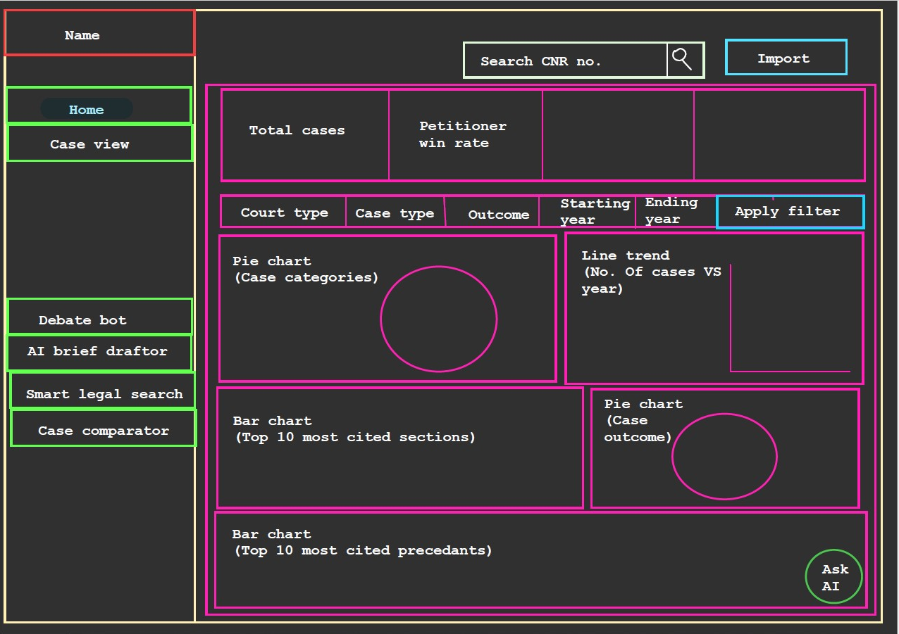

# Home Page — Legal Analytics Dashboard

## Overview
The Home Page provides a macro-level analytical view of the legal case database. It serves as the central hub for legal professionals to understand trends, patterns, and statistics across multiple cases — without manually reviewing individual documents.

---

## Layout & Structure

### Sidebar Navigation
The sidebar is the primary navigation panel of the application. It includes:

- **System Name / Branding**  
  Displayed prominently at the top of the sidebar, representing the identity of the platform.

- **Feature Links**  
  All major features of the system are listed as navigation items, allowing users to switch between modules seamlessly.

> The sidebar remains persistent across all pages, ensuring quick access to every part of the application at all times.

---

### Dashboard Display — Playground
The Home Page dashboard is rendered using a **Playground environment**, which provides an interactive, real-time visual interface.

- Dynamically updates charts, KPIs, and visualizations  
- Responds instantly to user-applied filters  
- Enables smooth data exploration and interaction  

---

## Key Features

### 1. KPI Metrics

Four high-level metrics are displayed at the top of the dashboard:

| Metric                    | Description |
|--------------------------|------------|
| Total Cases              | Total number of cases present in the database |
| Petitioner Win Rate      | Percentage of cases won by the petitioner |
| Judicial Velocity        | Speed at which cases are being resolved over time |
| Average Case Duration    | Average time taken from case filing to final judgment |

---

### 2. Filters

Users can refine the dashboard view using:

- **Court Type** — Supreme Court, High Court, District Court  
- **Case Type** — Civil, Criminal, Constitutional  
- **Outcome** — Allowed, Dismissed, Settled  
- **Start Year** — Beginning of time range  
- **End Year** — End of time range  

> All KPIs and visualizations update dynamically based on selected filters.

---

### 3. Search & Main Pipeline

The **Search functionality** acts as the entry point to the system’s core processing engine.

- When a user clicks **Search**, the **main extraction pipeline** is triggered.
- The pipeline processes legal case documents and extracts structured information such as:
  - Parties involved  
  - Legal sections cited  
  - Precedents  
  - Case outcomes  
  - Important dates  

This structured data is then used to power all dashboard insights and visualizations.

> The pipeline is the backbone of the system and ensures accurate, consistent, and scalable data processing.

---

### 4. Data Visualizations

The following charts are rendered inside the Playground:

| Chart                             | Type        | Purpose |
|----------------------------------|------------|--------|
| Case Categories                  | Pie Chart   | Distribution of cases across legal categories |
| Case Trends by Year              | Line Graph  | Year-over-year filing and resolution trends |
| Top 10 Most Cited Sections       | Bar Chart   | Frequently referenced legal sections |
| Case Outcome Distribution        | Pie Chart   | Breakdown of verdicts |
| Top 10 Most Cited Precedents     | Bar Chart   | Most referenced prior judgments |

---

### 5. Floating Ask AI Button — RealmAI (GPT-OSS-120B)

A floating **Ask AI** button is available across the application.

**Powered by:** RealmAi

#### Purpose:
- Answer natural language legal queries  
- Explain charts and trends  
- Provide insights on legal sections and precedents  
- Guide users in navigating the platform  

> The button remains persistently accessible, ensuring AI assistance is always one click away.

---

## Purpose

The Home Page enables legal professionals to perform high-level analysis of the entire case database through a unified interface.

It combines:
- Agent Builder
- Playground
- RealmAI
- App Maker
All within a single, interactive, and user-friendly dashboard.
